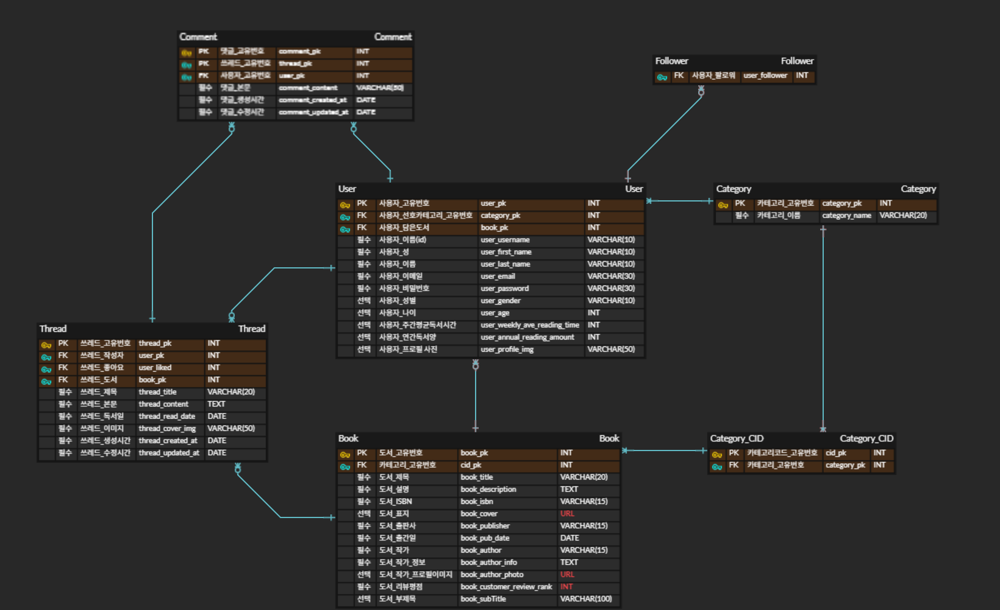

# 📚 도서 추천 웹 서비스

AI 기반으로 유사 도서를 추천해주는 웹 서비스입니다.  
Vue 3 + Django REST Framework 기반으로 구현되었으며,  
생성형 AI(GPT)를 활용해 설계 및 구현을 함께 진행했습니다.

---

## 1. 👥 팀원 정보 및 업무 분담

| 이름   | 역할                                                                             |
| ------ | -------------------------------------------------------------------------------- |
| 최선우 | 백엔드(Django, DRF), 프론트(Vue 3), 도서 검색, 회원 가입, 메이페이지 구현        |
| 김상경 | 백엔드(Django, DRF), 프론트(Vue 3), 쓰레드 CRUD, 팔로워/팔로잉, 좋아요 기능 구현 |

---

## 2. 🎯 목표 서비스 구현 및 실제 구현 정도

- 사용자 기반 도서 추천 기능 구현
- 실제 구현 항목:
  - [O] 회원가입 / 로그인 / 로그아웃
  - [O] 프로필 정보 및 사진 수정
  - [O] 도서 목록 + 카테고리 필터
  - [O] 도서 상세 정보 + 유저 리뷰
  - [O] AI 추천 도서 컴포넌트
  - [O] 팔로우 / 언팔로우 기능
  - [x] 배포 (현재 로컬에서 실행 가능)

---

## 3. 🗂 ERD (Entity Relationship Diagram)


**주요 모델**

- User
- Book
- Category
- Thread
- Comment

---

## 4. 🧠 도서 추천 알고리즘 설명

이 함수는 사용자가 보고 있는 책의 `description`을 기준으로, 내용이 유사한 다른 책을 추천해주는 콘텐츠 기반 추천 알고리즘입니다.

```python
from books.models import Book
from sklearn.feature_extraction.text import TfidfVectorizer
from sklearn.metrics.pairwise import cosine_similarity

def recommend_books_from_fixture(target_book, num=3):
    all_books = Book.objects.exclude(pk=target_book.pk)

    descriptions = [target_book.description] + [book.description for book in all_books]
    books_list = list(all_books)

    vectorizer = TfidfVectorizer().fit_transform(descriptions)
    similarities = cosine_similarity(vectorizer[0:1], vectorizer[1:]).flatten()

    similar_books = sorted(zip(similarities, books_list), key=lambda x: x[0], reverse=True)

    return [book for _, book in similar_books[:num]]
```

## 🔍 단계별 설명

### 1. 자기 자신 제외한 도서 목록 가져오기

```python
all_books = Book.objects.exclude(pk=target_book.pk)
```

### 2. 설명 텍스트 리스트 구성

```python
descriptions = [target_book.description] + [book.description for book in all_books]
```

### 3. TF-IDF 벡터화

```python
vectorizer = TfidfVectorizer().fit_transform(descriptions)
```

- 텍스트를 수치화해서 각 도서를 벡터로 변환합니다.

### 4. cosine similarity 계산

```python
similarities = cosine_similarity(vectorizer[0:1], vectorizer[1:]).flatten()
```

- 기준 책과 나머지 책들의 유사도를 계산합니다. (값: 0~1)

### 5. 유사도 높은 순으로 정렬

```python
similar_books = sorted(zip(similarities, books_list), key=lambda x: x[0], reverse=True)
```

### 6. 상위 N개 도서 반환

```python
return [book for _, book in similar_books[:num]]
```

---

## 5. 🔧 핵심 기능

- JWT 기반 사용자 인증
- 마이페이지 (팔로우 수, 수정 버튼, 리뷰 이력)
- 도서 목록 조회 및 카테고리 필터링
- 도서 상세 페이지 + 리뷰 CRUD
- 유사 도서 추천 시스템
- Pinia 상태 관리 + Axios 통신

---

## 6. 🤖 생성형 AI 활용

- GPT와 함께:
  - ERD 설계 및 피드백
  - 비즈니스 로직/뷰 구성 논의
  - CSS 레이아웃 리팩토링
  - 추천 알고리즘 구조 설계

---

## 7. 💬 느낀 점

- 최선우

  > GPT와 협업하며 빠르게 구조 잡고 구현할 수 있었고, 예외처리도 안정적으로 마무리할 수 있었다. 실시간 AI 피드백이 큰 도움이 되었습니다.
  > 처음엔 막막했습니다. 배운 건 많았지만, ‘내가 정말 할 수 있을까?’ 하는 생각에 자신이 없었습니다. 하지만 페어와 함께하면서 점차 방향을 잡을 수 있었고, 원하던 기능을 제 시간 안에 완성할 수 있어 무척 만족스럽습니다.
  > 아주 기본적인 기능들이지만, 제 인생 첫 페이지를 직접 구현했다는 점에서 더 의미 있고 뿌듯하게 느껴졌습니다.
  > 함께 고생한 모든 분들, 그리고 특히 큰 도움을 준 페어 상경경에게 감사의 인사를 전하고 싶습니다.

- 김상경
  > 이 때까지 배운 Python과 Vue 등을 활용해 RESTFUL 프로젝트를 완성했는데, 만드는 과정과 학습은 쉽지 않았지만 완성된 결과를 보니 만족하는 결과가 나와 좋았습니다.
  > 프로젝트 계획부터 구성 등 하나하나 생각해야 할 부분이 생각보다 많았고, 알아야 할 것 도 아직 정말 많다는 생각을 했습니다.
  > 추후엔 대규모 서비스 개발에 목표를 두고, 더 열심히 해야겠다는 생각을 했고, 지금 프로젝트를 무사히 마칠 수 있도록 같이 고생해준 선우팀장님께 감사의 인사를 올립니다!
